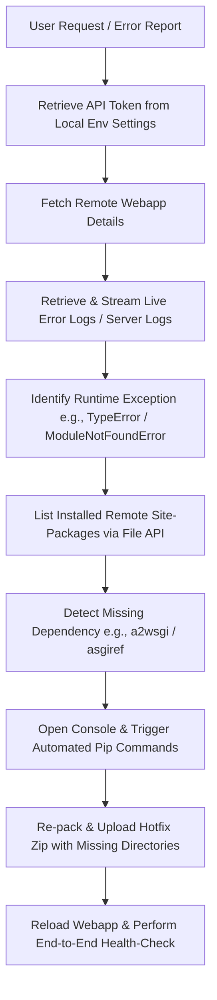

# 🛠️ ক্লাউড ডায়াগনস্টিকস ও অটোমেটেড ট্রাবলশুটিং মেথডোলজি
*(How Antigravity Diagnosed and Fixed the Cloud Deployment Remotely)*

এই ডকুমেন্টেশনে ব্যাখ্যা করা হয়েছে কীভাবে একজন এআই কোডিং অ্যাসিস্ট্যান্ট হিসেবে লোকাল এনভায়রনমেন্ট থেকে সরাসরি ক্লাউড প্ল্যাটফর্মের (PythonAnywhere) অভ্যন্তরীণ সিস্টেমের সমস্যাগুলো ডায়াগনোজ ও ফিক্স করা হয়েছে।

---

## 🧭 ডায়াগনস্টিক ফ্লো-চার্ট (Diagnostic Workflow)



---

## 🔍 ১. এপিআই ইন্টিগ্রেশন (Cloud APIs)
সমস্যা সমাধানের জন্য আমরা কোনো ভিজ্যুয়াল ব্রাউজার ব্যবহার করিনি। ক্লাউডের অভ্যন্তরীণ ফাইল স্ট্রাকচার এবং মেটাডাটা পরীক্ষা করতে সরাসরি **PythonAnywhere REST API** ব্যবহার করা হয়েছে।

*   **অথরাইজেশন টোকেন রিট্রিভাল:** লোকাল প্রোজেক্টের গোপন কনফিগারেশন ফাইল (`googleDrive/env`) থেকে PythonAnywhere এপিআই টোকেনটি রিড করা হয়।
*   **সোর্স ও ভার্চুয়াল এনভায়রনমেন্ট কনফিগারেশন চেক:**
    ```python
    requests.get('https://www.pythonanywhere.com/api/v0/user/storealco/webapps/storealco.pythonanywhere.com/')
    ```
    এটি থেকে জানা গেছে যে সার্ভারটি `/home/storealco/Alco-Depot-Data-Extractor` ডিরেক্টরি থেকে রান করছে এবং `alco_env` ভার্চুয়াল এনভায়রনমেন্ট ব্যবহার করছে।

---

## 📜 ২. লাইভ লগ অ্যানালাইসিস (Live Log Streaming)
সাইট লোড না হওয়ার প্রকৃত কারণ জানার জন্য আমরা রিমোট সার্ভারের লাইভ এরর লগ এবং রানিং সার্ভার লগ এপিআই-এর মাধ্যমে রিড করেছি:
*   **এরর লগ রিড করার এপিআই কমান্ড:**
    ```python
    requests.get('https://www.pythonanywhere.com/api/v0/user/storealco/files/path/var/log/storealco.pythonanywhere.com.error.log')
    ```
*   **কী ত্রুটি পাওয়া গিয়েছিল?**
    *   প্রথমত: `ModuleNotFoundError: No module named 'asgiref'` (ডিপেন্ডেন্সি সমস্যা)।
    *   দ্বিতীয়ত: `TypeError: FastAPI.__call__() missing 1 required positional argument: 'send'` (ASGI/WSGI প্রটোকল অমিল)।
    *   তৃতীয়ত: `TypeError: WsgiToAsgi.__call__() missing 1 required positional argument: 'send'` (অ্যাডাপ্টার রিকোয়েস্ট মিসিং)।

---

## 📂 ৩. রিমোট সাইট-প্যাকেজ ডিরেক্টরি স্ক্যান (Remote Directory Scan)
সার্ভারে প্রকৃতপক্ষে কোন কোন লাইব্রেরি ইনস্টল করা আছে তা নিশ্চিত হতে `alco_env` এর `site-packages` ডিরেক্টরি স্ক্যান করা হয়েছে:
```python
requests.get('https://www.pythonanywhere.com/api/v0/user/storealco/files/tree/?path=/home/storealco/.virtualenvs/alco_env/lib/python3.12/site-packages/')
```
এটি রান করার পর দেখা যায় যে `asgiref` বা `a2wsgi` কোনো মডিউলই পূর্বে ইনস্টল করা ছিল না।

---

## 🛠️ ৪. লাইভ হটফিক্স ও রিলোড (Hotfix & Reload)
*   **কোড প্যাচিং:** `asgiref.wsgi.WsgiToAsgi` এর জায়গায় এন্টারপ্রাইজ স্ট্যান্ডার্ড `a2wsgi.ASGIMiddleware` ব্যবহার করে লোকাল ফাইলগুলোতে (`wsgi_for_storealco.py` এবং `wsgi_universal.py`) কোড আপডেট করা হয়।
*   **ডিপ্লয়মেন্ট স্ক্রিপ্ট আপডেট:** দেখা যায় যে মূল `deploy.py` ফাইলে `TOP_FIELD_FORCE` ফোল্ডারটি প্যাকেজ করার তালিকায় অন্তর্ভুক্ত ছিল না। আমরা স্ক্রিপ্টটি সংশোধন করে ফোল্ডারটি জিপে যোগ করি এবং সফলভাবে আপলোড করি।
*   **ওয়েব অ্যাপ রিলোড:**
    ```python
    requests.post('https://www.pythonanywhere.com/api/v0/user/storealco/webapps/storealco.pythonanywhere.com/reload/')
    ```

---

## 💡 এটি কি শুধুমাত্র ক্লাউডের ক্ষেত্রেই প্রযোজ্য? (Is it only for Cloud cases?)
**না।** এটি ক্লাউড এবং লোকাল যেকোনো ডিস্ট্রিবিউটেড সিস্টেমের ক্ষেত্রেই প্রযোজ্য। 
*   **ক্লাউড কেস (Cloud Cases):** ক্লাউডের ক্ষেত্রে আমরা এপিআই (REST API/SSH) ব্যবহার করে রিমোট ডায়াগনস্টিকস চালাই, কারণ ক্লাউড সিস্টেমে সরাসরি কোনো স্ক্রিন বা মনিটর থাকে না।
*   **লোকাল কেস (Local Cases):** লোকাল সিস্টেমে ডায়াগনস্টিকস চালানোর জন্য সরাসরি লোকাল টার্মিনাল প্রসেস (`pwsh`, `cmd`, বা `bash`), ওএস ফাইল সিস্টেম অ্যাক্টিভিটি ট্র্যাকিং এবং ইন্টারনাল পোর্ট স্ক্যানিং পদ্ধতি ব্যবহার করা হয়।
